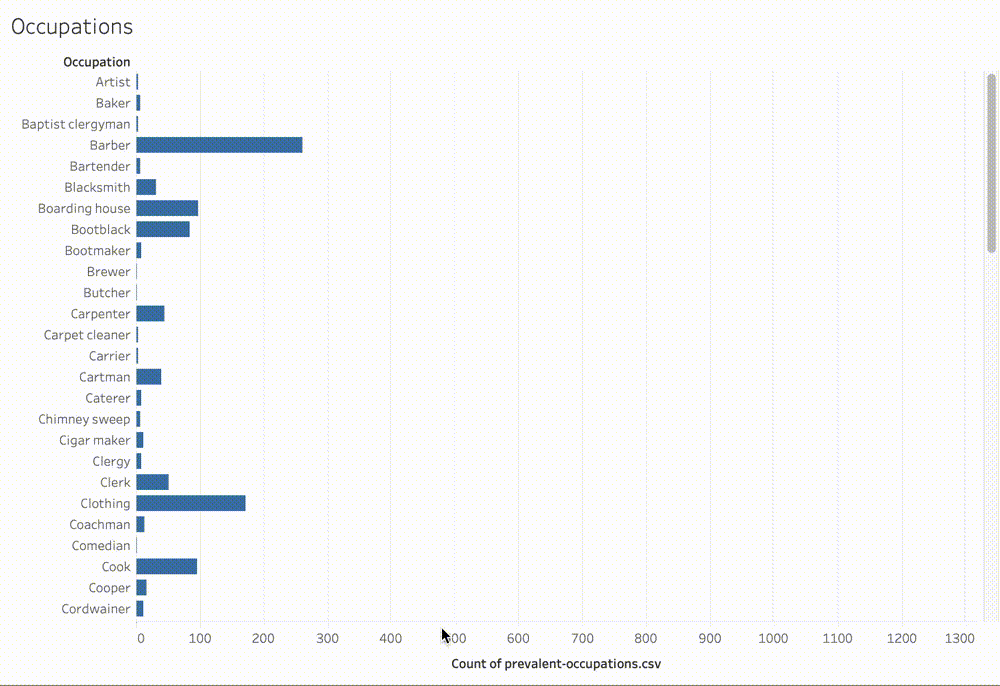

Datasets from the [Boston Athenaeum Directory of African Americans in Boston, 1826-1860](https://www.bostonathenaeum.org/library/electronic-resources/boston-athenaeum-directory-african-americans-in-boston-1820-1865).

The original database exists as an access database. We have exported data from this database in various formats to support data experimentation for the Mapping Black Boston project. 

`addresses.csv` is a full export of the `addresses` tab in the original database.

`prevalent-occupations` is from the `occupations` tab, but it has been cleaned up a bit to standardize names of occupations for more consistent groupings. Records of persons with an uncommon occupation have been either removed or consolidated. For instance, we consolidated 'sculptress' (for which there was only one record) in with 'artist'. We performed this cleaning to make visualizing and exploring the data a little more manageable, but if you want to see all the occupations transcribed from the various primary sources, you should consult the original `occupations` tab in the access.db. 

_Distribution of occupations in `prevalent-occupations.csv`._

`athenaeum-joined.csv` pieces together components from different tables in the access db, mostly to get information about a person's name, address, and occupation into one table which can be joined with spatial data. This table includes all of the records from the access database, regardless of whether a record has address information or not.

`athenaeum-joined-cleaned.csv` cleans up the joined table to make the data more compatible with various project tasks. For instance, we removed all records with no address information and formatted attribute data types.

The data in the `streets` and `years` folders are street-by-street or year-by-year subsets to test and establish workflow.